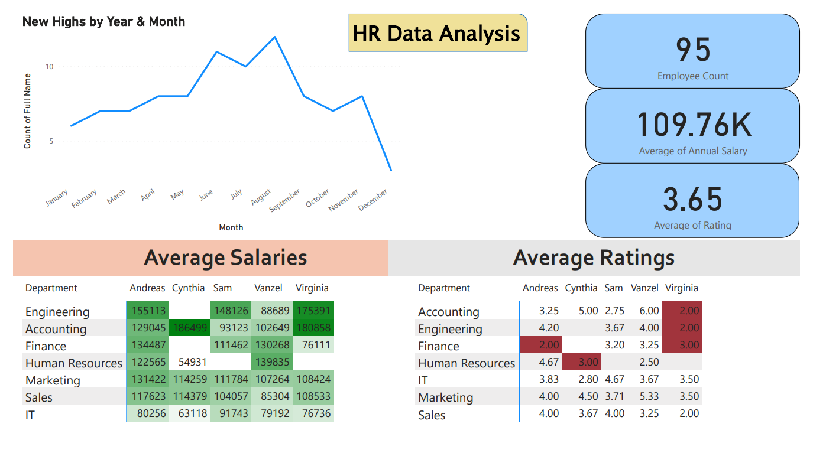

# HR-Data-Analysis
HR Data Analysis Dashboard: A Power BI dashboard to provide insights into employee count, average salaries, ratings, and hiring trends by month for effective HR decision-making.

# HR Data Analysis Dashboard in Power BI

## Overview
This repository contains an interactive HR Data Analysis dashboard created using Power BI. The dashboard offers key insights into various human resource metrics such as employee count, average salaries, performance ratings, and hiring trends throughout the year.

## Key Features
- **Employee Count:** Displays the total number of employees (95).
- **Average Annual Salary:** Displays the average salary across all employees ($109.76K).
- **Average Rating:** Displays the average employee performance rating (3.65).
- **Hiring Trend Analysis:** Visualizes the trend of new hires over the year by month.
- **Average Salaries Analysis by Department & Employee:** Uses a heatmap to highlight salary differences across various departments and employees, providing an easy way to identify any disparities.
- **Average Ratings by Department & Employee:** Displays the performance ratings across different departments to help identify top and underperformers.

## Files in the Repository
- `HR-Data-Dashboard.pbix`: The Power BI Desktop file for the HR Data Analysis dashboard.
- `README.md`: Project overview, features, and usage instructions.
- `hr-dashboard-image.png`: A screenshot of the HR dashboard to visually represent the project.

## About the Dashboard
The HR Data Analysis Dashboard was created to help HR professionals and decision-makers gain a deeper understanding of the workforce. By visualizing data such as salaries, ratings, and hiring trends, the dashboard provides actionable insights for improving HR strategies and enhancing overall productivity.

## How to Use
1. **Clone or download the repository:**2. **Open the `.pbix` file in Power BI Desktop.**
2. **Explore and interact with the dashboard:**
- View and analyze employee count, hiring trends, and average salaries and ratings.
- Identify areas for improvement in salary distribution and employee performance.

## Screenshot

## Tools & Technologies
- **Power BI**: Data visualization and business intelligence.
- **Data Source**: HR data for insights into employee performance and compensation.

